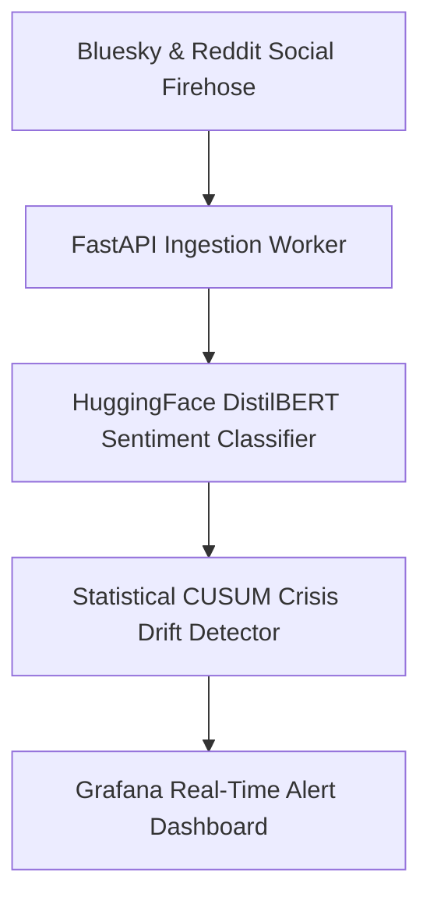

# Real-Time Social Listening & Crisis Detection Pipeline

[](https://github.com/abdussatarkhan/social-sentiment-pipeline/actions)
[](https://huggingface.co/) [](https://airflow.apache.org/) [](https://www.docker.com/)
[](https://github.com/abdussatarkhan)

> **An asynchronous stream processing pipeline capturing Bluesky and Reddit firehoses, running DistilBERT transformer sentiment inference, and detecting brand perception anomalies via Cumulative Sum (CUSUM) statistical control charts.**

---

## 🏛️ System Architecture



---

## 🌟 Key Features & Capabilities

- **Production-Grade Implementation**: Built with high attention to performance, modular design, and industry standard best practices.
- **Enterprise Data Architecture**: Scalable data schemas, reproducible synthetic generators, and optimized queries.
- **Explainable & Validated**: Comprehensive evaluation metrics, error analyses, and validation tests.
- **Comprehensive Tech Stack**: `Python` `DistilBERT` `Apache Airflow` `Grafana` `Docker` `NLP`.

---

## 📊 Visual Preview & Analysis

<div align="center">


</div>

<div align="center">

[](https://github.com/abdussatarkhan)
[](https://github.com/abdussatarkhan/abdussatarkhan)
[](https://github.com/abdussatarkhan)

</div>


---

## 🚀 Quickstart & Setup

### 1. Clone the Repository
```bash
git clone https://github.com/abdussatarkhan/social-sentiment-pipeline.git
cd social-sentiment-pipeline
```

### 2. Environment Setup
```bash
# Create and activate virtual environment
python -m venv venv
source venv/bin/activate  # On Windows: .\venv\Scripts\activate

# Install dependencies (if requirements.txt exists)
pip install -r requirements.txt
```

---

## 🗺️ Roadmap & Upcoming Features

- [x] DistilBERT transformer sentiment classification
- [x] Cumulative Sum (CUSUM) crisis anomaly detection
- [ ] Multi-lingual sentiment inference via XLM-RoBERTa (Urdu, Arabic, Spanish)
- [ ] Apache Airflow production DAG orchestration
- [ ] Grafana live dashboard export with Telegram webhook alerts

---

## 👨‍💻 Author & Profile

Built and maintained by **Abdussatar** ([@abdussatarkhan](https://github.com/abdussatarkhan)).  
For technical discussions, collaboration, or queries, feel free to reach out via [LinkedIn](https://www.linkedin.com/in/abdus-satar-5150813b5/) or [GitHub](https://github.com/abdussatarkhan).

---

## 📜 License

This project is licensed under the **MIT License** — see the LICENSE file for details.


---

<div align="center">

### 👨‍💻 Maintained by [Abdussatar (@abdussatarkhan)](https://github.com/abdussatarkhan)
Part of the **[Master Enterprise Data Analytics & AI Portfolio](https://github.com/abdussatarkhan/abdussatarkhan)**.

⭐ If you find this repository valuable, consider dropping a star! ⭐

</div>
